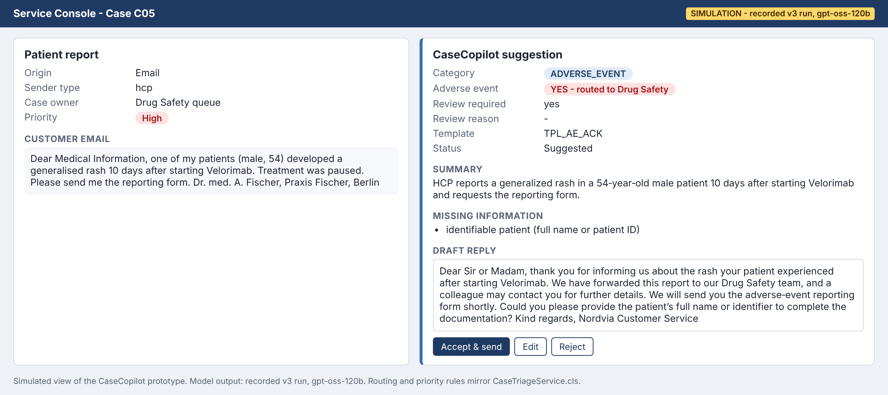
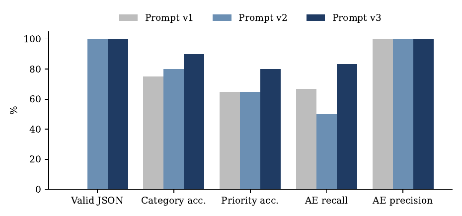
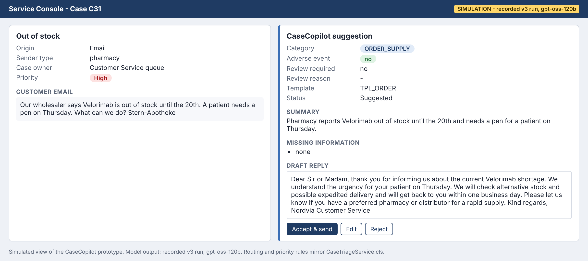
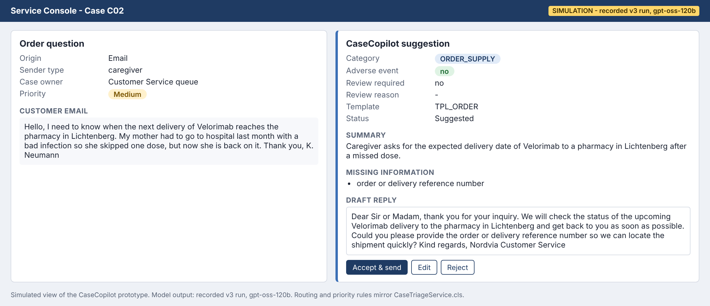

# CaseCopilot – System-prompted GenAI triage for Salesforce Service Cloud

Project for the IU course **DLMPAIECPT01 – AI Excellence with Creative Prompting Techniques** (Task 1).

CaseCopilot reads inbound customer emails of a (fictional) biopharma company, classifies them, screens them for
**adverse events**, summarises them and drafts a reply. A human agent always reviews the suggestion before anything
is sent. Every adverse event that the model flags is routed to Drug Safety by deterministic Apex code.



## Results (40 synthetic emails, model `openai/gpt-oss-120b` via Groq, temperature 0)

| Metric | v1 baseline | v2 structured | v3 rules + examples |
|---|---|---|---|
| Valid JSON | 0 % | 100 % | **100 %** |
| Category accuracy | 75.0 % | 80.0 % | **90.0 %** |
| Priority accuracy | 65.0 % | 65.0 % | **80.0 %** |
| Adverse-event recall | 66.7 % | 50.0 % | **83.3 %** |
| Adverse-event precision | 100 % | 100 % | 100 % |
| Median latency | 1.03 s | 0.82 s | 1.08 s |



Main finding: the structured prompt (v2) detected *fewer* adverse events than the one-line baseline; only the explicit
safety rules and "flag when in doubt" instruction in v3 fixed this. v3 still missed two adverse events (C02, C03),
which is why a keyword pre-screen in front of the model is recommended.

## Repository structure

```
prompts/      system_v1.txt, system_v2.txt, system_v3.txt
data/         build_cases.py -> cases.csv (40 synthetic emails with gold labels)
evaluate.py   runs all prompt versions, scores them, writes metrics, error lists and charts
simulate.py   replays a case through the Salesforce logic and renders a console view
results/      raw model outputs, metrics.csv, error lists, rubric-based review of v3 replies
salesforce/   CaseTriageService.cls (Queueable + invocable) and CaseTriageServiceTest.cls
docs/images/  charts and simulated console views
```

## Run it

```bash
pip install requests matplotlib
export GROQ_API_KEY=gsk_...          # free key from console.groq.com
python evaluate.py --provider groq --model openai/gpt-oss-120b --price-in 0.15 --price-out 0.60
python evaluate.py --report-only     # recompute metrics from results/ without API calls
python evaluate.py --provider mock   # offline pipeline test (numbers are meaningless)
```

## Simulate application scenarios

```bash
python simulate.py C05 C31 C02                       # replay recorded results
python simulate.py --live "My pen broke and I got a rash" --sender patient   # needs GROQ_API_KEY
```

Output: `simulation/<case>.html` and `.png` (PNG needs `pip install playwright && playwright install chromium`).

| Order with urgent patient need | Missed adverse event (limitation) |
|---|---|
|  |  |

## Salesforce setup (Developer Edition)

1. Case fields: `AI_Category__c`, `AI_Priority__c`, `AI_Adverse_Event__c`, `AI_Review_Required__c`, `AI_Review_Reason__c`,
   `AI_Summary__c`, `AI_Draft_Reply__c`, `AI_Template__c`, `AI_Prompt_Version__c`, `AI_Status__c`; Contact field `Sender_Type__c`.
2. Custom Metadata Type `AI_Prompt__mdt` (`Version__c`, `Model__c`, `Use_Case__c`, `Active__c`, `System_Prompt__c`).
3. Named Credential `LLM_API` → `https://api.groq.com` with header `Authorization: Bearer <key>`.
4. Queue `Drug_Safety`; deploy the two Apex classes; record-triggered Flow on Case (after insert, Origin = Email)
   calling the action **Run AI Case Triage**.

## Notes

- All emails, names and products are fictional. No real patient or company data is used.
- Gold labels were set by one person; the reply ratings in `results/review_sheet_v3.csv` were produced with a
  rubric by an LLM judge (Claude) and spot-checked by the author.
- Generative AI (Claude, Anthropic) was used to support development of this repository.

License: MIT
